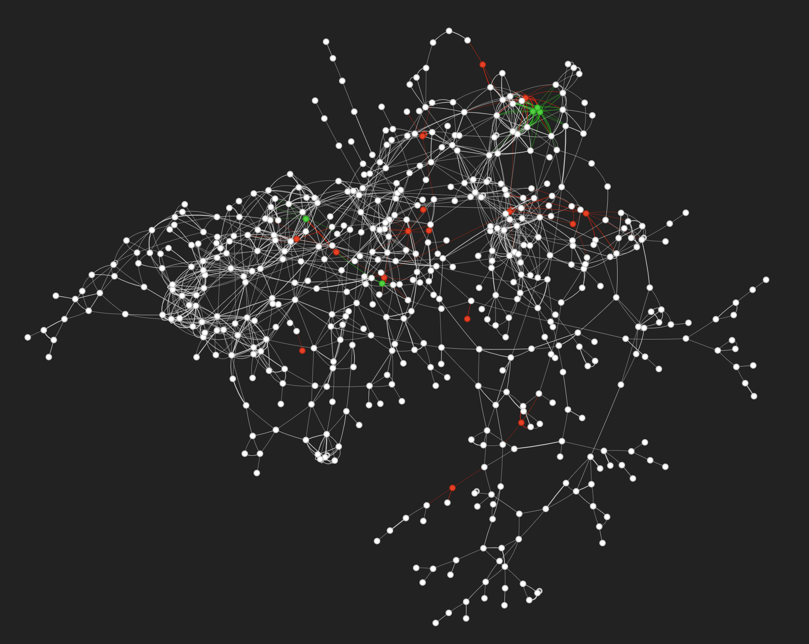

run sample_and filter.py, then run compute_similarity.py.
import into neo database, then run cypher queries

Please see recs.pdf for full results!

Here's a fun graph of our db's largest connected component:

